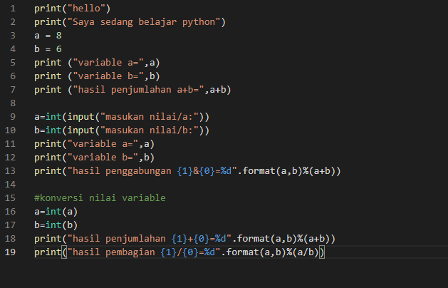
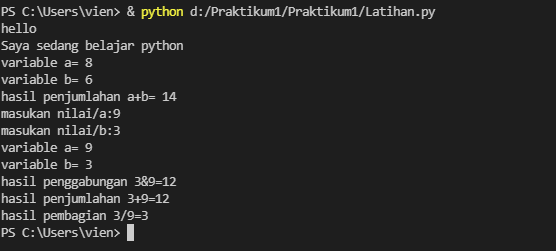
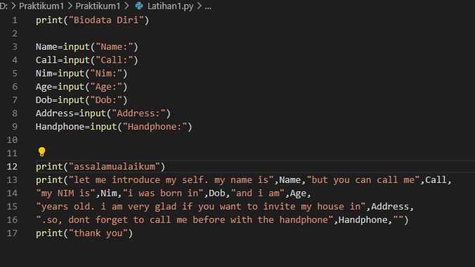
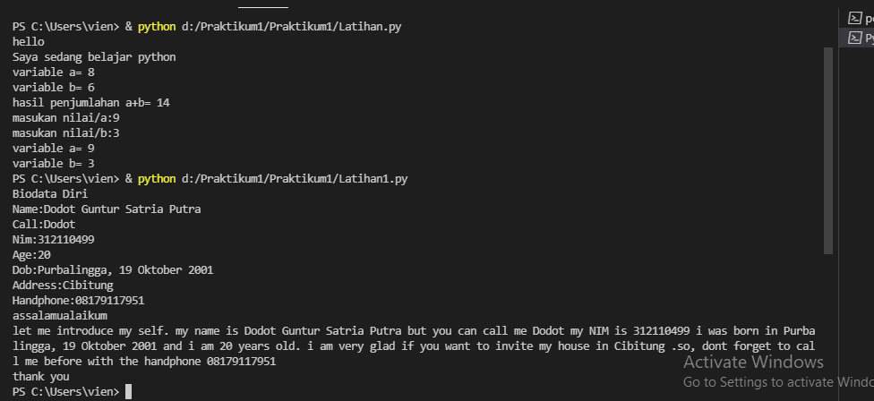

# Praktikum1
<h1> NAMA   :   DODOT GUNTUR SATRIA PUTRA
     NIM    :   312110499 
     KELAS  : TI.21.C1
     TUGAS BAHASA PEMOGRAMAN <h1>

# Program penjumlahan dan pembagian

 buat script seperti berikut 

kemudian run, input nilai a dan b. maka hasil nya seperti ini

# Program biodata

 buat scrip seperti berikut

kemudian run, input data diri. maka hasilnya seperti ini

